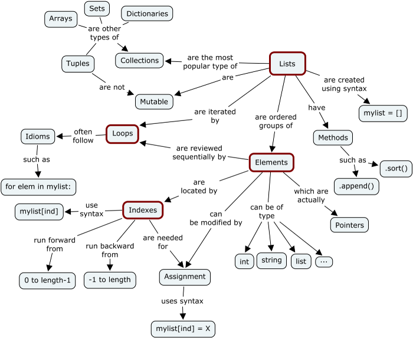

### 9. Tips & Tricks

#### Common Data Types
 - [Numbers](https://www.w3schools.com/python/python_numbers.asp)
 - [List](https://www.w3schools.com/python/python_lists.asp)
 - [Tuple](https://www.w3schools.com/python/python_tuples.asp)
 - [Strings](https://www.w3schools.com/python/python_strings.asp)
 - [Set](https://www.w3schools.com/python/python_sets.asp)
 - [Dictionary](https://www.w3schools.com/python/python_dictionaries.asp)
 - <mark>*[Learn more from W3Schools](https://www.w3schools.com/python/)*</mark>

#### *Mutable and Immutable Objects*
- Everything in Python is an object. And what every newcomer to Python should quickly learn is that all objects in Python can be either mutable or immutable.

- Lets dive deeper into the details of it… Since everything in Python is an Object, every variable holds an object instance. When an object is initiated, it is assigned a unique object id. Its type is defined at runtime and once set can never change, however its state can be changed if it is mutable. Simple put, a mutable object can be changed after it is created, and an immutable object can’t.


| Class       | Description                           | Immutable?  |
|:------------|:--------------------------------------|:-----------:|
| bool        | Boolean value                         | ✘           |
| int         | integer (arbitary magniture)          | ✘           |
| float       | floating-point number                 | ✘           |
| tuple       | immutable sequence of objects         | ✘           |
| str         | Character string                      | ✘           |
| frozenset   | immuable form of set class            | ✘           |
| set         | unordered set of distinct objects     |             |
| list        | mutable sequence of objects           |             |
| dict        | associative mapping (aka dictionary)  |             |

#### *Dictionary*
```python
# Recomendation when use dictionary to avoid confusion with list/array behavior
a_dict = dict(
    key_1="value_1",
    key_2="value_2"
)

# Accessing Elements from Dictionary
# Use `dict.get(key, default)` instead of dict[key]
a_dict.get("key_1", "default_value")
# Only use like below if the key is required and you want to raise an exception
a_dict["key_3"] # Will raise an exception

# Alway use `.update()` to modify a dictionary
a_dict.update(key_3="value_3", key_4="value_4")

# Merge 2 dict
dict_1.update(dict_2)
dict_3 = dict(**dict_1, **dict_2) # New dict

# Merge 2 dict and sum the value (number)
from collections import Counter
dict_3 = dict(Counter(dict_1) + Counter(dict_2))

# Make a dictionary from 2 lists (keys and values)
dict(zip(["key_1", "key_2"], ["value_1", "value_2"]))

# Use the deepcopy function in the copy module
# to make a true copy of a dictionary containing mutable objects, such as a list.
import copy
original = dict(obj=dict(a=dict(b=[1])))
dict_shallow = original.copy()
dict_deep = copy.deepcopy(original)
original["obj"]["a"]["b"] = [2] # This will change the mutable object in original and dict_shallow

# Use defaultdict when you want to append values to non exist key
from collections import defaultdict as dd
empty_dict: dict = dd(list)
empty_dict["key_1"].append("value_1")

# Convert list of tuples to dictionary use defaultdict
from collections import defaultdict as dd
_tuple = [("John", "Male", 25), ("Fred", "Female", 48)]
dict_1 = dd(dict)
for name, gender, age in _tuple:
    dict_1[name]["age"] = age
    dict_1[name]["gender"] = gender
dict_1.get("John") -> {"age": 25, "gender": "Male"}
```

#### *List*
```python
# Checking whether any element in the sequence is Truthful
In [1]: any([0, 1, True, None])
Out[1]: True

# Checking whether all elements in the sequence are Truthful
In [2]: all([0, 1, True, None])
Out[2]: False

# Given each iterable we construct a tuple by adding an index.
In [3]: a = ['Hello', 'world', '!']
In [4]: list(enumerate(a))
Out[4]: [(0, 'Hello'), (1, 'world'), (2, '!')]

# Getting min/max from iterable (with/without specific function).
In [5]: a = [1, 2, -3]
In [6]: max(a) # Getting maximum from iterable
Out[6]: 2
In [7]: min(a) # Getting maximum from iterable
Out[7]: -3
In [8]: max(a, key=abs) # Bot min/max has key value to allow to get maximum by appliing function
Out[8]: -3

# Initializing a list filled with some repetitive number.
In [9]: [1, 2] * 3
Out[9]: [1, 2, 1, 2, 1, 2]

# Reversing an iterable wit order (string, list etc).
In [10]: s[::-1]
Out[10]: 'cba'
In [11]: l = ["a", "b", "c"]
In [12]: l[::-1]
Out[12]: ['c', 'b', 'a']
```

#### *Branching*
```python
# Multiple predicates short-cut.
In [1]: n = 10
In [1]: 1 < n < 20
Out[2]: True

# For-else construct useful when searched for something and find it.
for i in mylist:
    if found_something:
        break
else:
    print("Result NotFound!")

# Try-catch-else construct.
try:
    pass
except Exception:
    print("Exception occured!")
else:
    print("Exception didn't occur!")
finally:
    print("Always gets here!")

# While-else construct.
while 1:
    break
else:
    # Only goes there if the while above do not break
    print("Finished up!")

# Trenary operator.
In [2]: "I'm A Man" if True else "I'm gay"
Out[2]: "I'm A Man"
```

#### *Comprehensions*
```python
# List comprehension.
condition = True # It can be a function
In [1]: [x ** 2 for x in range(5) if condition]
Out[1]: [0, 1, 4, 9, 16]

# Set comprehension.
In [2]: [x ** 2 for x in range(5) if condition]
Out[2]: {0, 1, 4, 9, 16}

# Dict comprehension.
In [3]: {x: x ** 2 for x in range(5) if condition}
Out[3]: {0: 0, 1: 1, 2: 4, 3: 9, 4: 16}

# Generator comprehension.
# A generator comprehension is the lazy version of a list comprehension.
In [4]: m = (x ** 2 for x in range(5))
Out[4]: <generator object <genexpr> at 0x7f0a48b4ec50>
In [5]: list(m)
Out[5]: [0, 1, 4, 9, 16]
```

#### *Unpacking variables*
```python
# Unpack variables from iterable.
a, b, c = 1, 2, 3
a, b, c = [1, 2, 3]

# Swap variables values.
a, b = 1, 2
a, b = b, a

# Unpack variables from iterable without indicating all elements.
a, *b, c = [1, 2, 3, 4, 5]
=> a = 1, b = [2, 3, 4], c = 5
```

#### *Itertools*
https://docs.python.org/2/library/itertools.html
```python
# Flatten iterables.
In [1]: list(itertools.chain.from_iterable([[1, 2], [3, 4], [5, 6]]))
Out[1]: [1, 2, 3, 4, 5, 6]

# Creating cartesian products from iterables.
In [2]: list(itertools.product([1, 2, 3], [4, 5]))
Out[2]: [(1, 4), (1, 5), (2, 4), (2, 5), (3, 4), (3, 5)]

# Creating an iterator that returns elements from the iterable as long as the predicate is true
In [3]: list(itertools.takewhile(lambda x: x < 3, [0, 1, 2, 3, 4]) )
Out[3]: [0, 1, 2]
In [4]: list(itertools.dropwhile(lambda x: x < 3, [0, 1, 2, 3, 4]))
Out[4]: [3, 4]

# Keeping only false values
In [4]: list(itertools.filterfalse(bool, [None, False, 1, 0, 10]))
Out[4]: [None, False, 0]

```

#### *Collections*
- Set basic operations.
```python
In [1]: A = {1, 2, 3, 3}
In [2]: B = {3, 4, 5, 6, 7}
In [3]: A | B
Out[3]: {1, 2, 3, 4, 5, 6, 7}
In [4]: A & B
Out[4]: {3}
In [5]: A - B
Out[5]: {1, 2}
In [6]: B - A
Out[6]: {4, 5, 6, 7}
In [7]: A ^ B
Out[7]: {1, 2, 4, 5, 6, 7}
```

- Ordered dict structure (a subclass of dictionary that keeps order).
```python
from collections import OrderedDict
In [8]: d = OrderedDict.fromkeys('abc')
In [8]: d.move_to_end('b')
In [8]: d.keys()
Out[8]: odict_keys(['a', 'c', 'b'])
In [9]: d.move_to_end('b', last=False)
In [9]: d.keys()
Out[9]: odict_keys(['b', 'a', 'c'])
```

- Deques structure (Deques are a generalization of stacks and queues).
```python
In [1]: import collections
In [2]: dq = collections.deque()
In [3]: dq.append(1)
In [4]: de.appendleft(2)
In [5]: dq.extend([3, 4])
In [6]: dq.extendleft([5, 6])
In [7]: dq.pop()
Out[7]: 4
In [8]: dq.popleft()
Out[8]: 6
In [9]: dq
Out[9]: deque([5, 2, 1, 3])
In [10]: dq.rotate(3)
In [11]: dq
Out[11]: deque([2, 1, 3, 5])
In [12]: dq.rotate(-3)
In [13]: dq
Out[13]: deque([5, 2, 1, 3])
In [14]: collections.deque(dq, maxlen=2)
Out[14]: deque([3, 5])
```

- SimpleNamespace<mark>(Mutable)</mark> is basically just a nice facade on top of a dictionary. It allows you to use properties instead of index keys. This is nice as it is super flexible and easy to manipulate.

```python
>>> from types import SimpleNamespace
>>> sn = SimpleNamespace(x=1, y= 2)
>>> sn
namespace(x=1, y=2)
>>> sn.z = 'foo'
>>> del(sn.x)
>>> sn
namespace(y=2, z='foo')
```

- NamedTuple<mark>(Immutable)</mark> structure (create tuple-like objects that have fields accessible by attribute lookup as well as being indexable and iterable).

```python
>>> import collections
>>> Point = collections.namedtuple('Point', ['x', 'y'])
>>> p = Point(x=1.0, y=2.0)
>>> p
Point(x=1.0, y=2.0)
>>> p.x
1.0
>>> p.y
2.0
```

---
**Python Type Conversion and Type Casting (Noted):**
1. Type Conversion is the conversion of object from one data type to another data type.
2. Implicit Type Conversion is automatically performed by the Python interpreter.
3. Python avoids the loss of data in Implicit Type Conversion.
4. Explicit Type Conversion is also called Type Casting, the data types of objects are converted using predefined functions by the user.
5. In Type Casting, loss of data may occur as we enforce the object to a specific data type.
